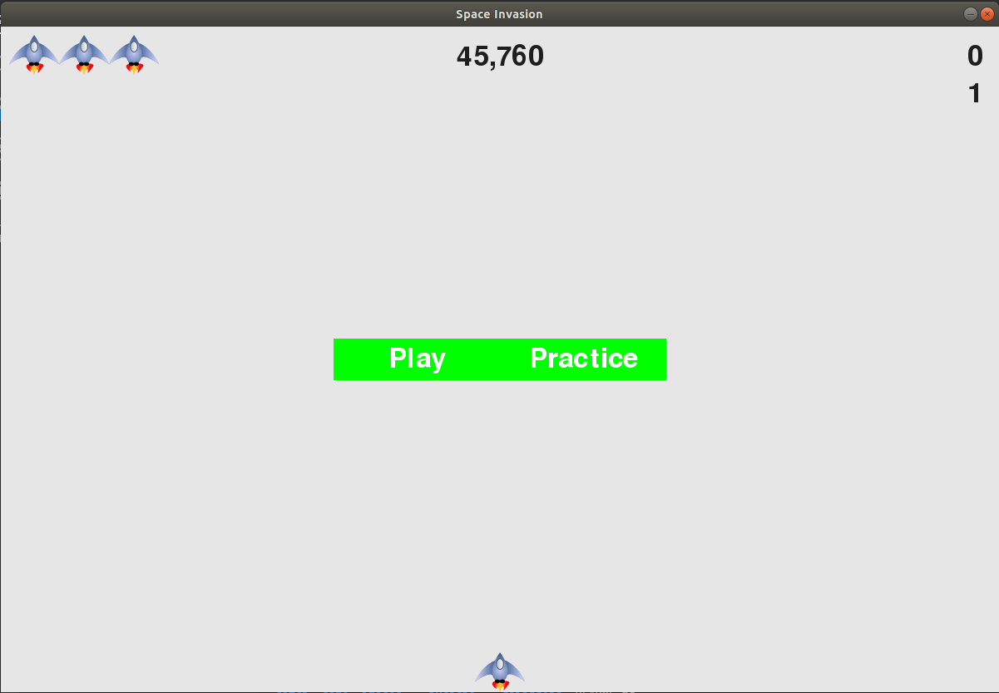
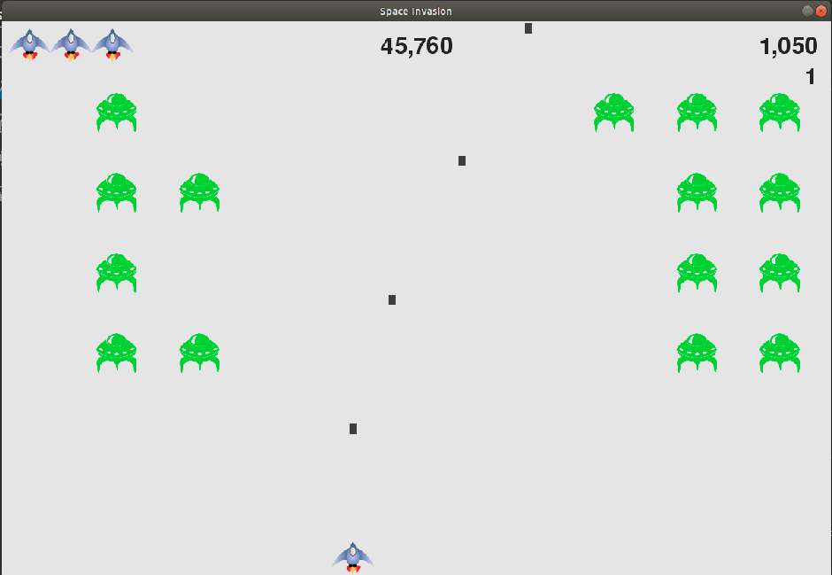
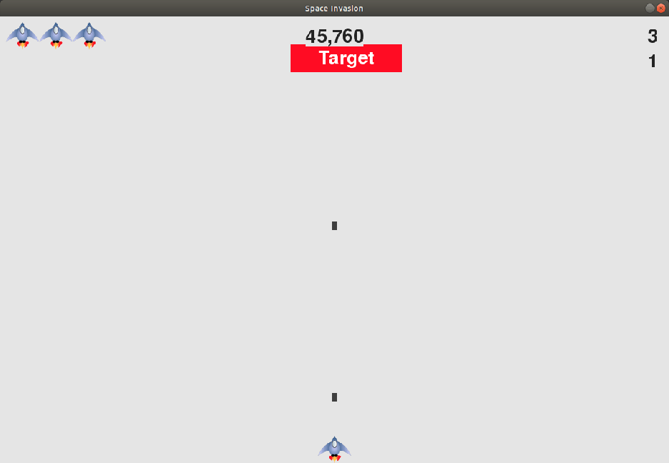

# Space Invasion

Implementation and expansion of the classic Space Invaders game using the PyGame.

New features include a practice mode, game of catch, and raindrop simulation. 

## Prerequisites

* [Python 3.x] (https://www.python.org/downloads/) 
* [PyGame 1.9.x] (https://www.pygame.org/download.shtml)

## Getting Started

1. Clone the repository:
```bash
$ git clone
```
Or download as a zip and extract.

2. Run game by navigating to /space_invasion_integrated/game and entering 

```bash
python ./run_game.py
```
Menu:



Game:



Practice



3. Play catch by navigating to /space_invasion_integrated/catch and entering 

```bash
python ./run_catch.py
```

4. Watch raindrops by navigating to /space_invasion_integrated/raindrops and entering

```bash
python ./run_drops.py
```

## Built With

* [PyGame](https://www.pygame.org/news) - Game framework

## Acknowledgments

* Developed from Eric Matthes' Alien Invasion game from [Python Crash Course] (https://github.com/ehmatthes/pcc)

